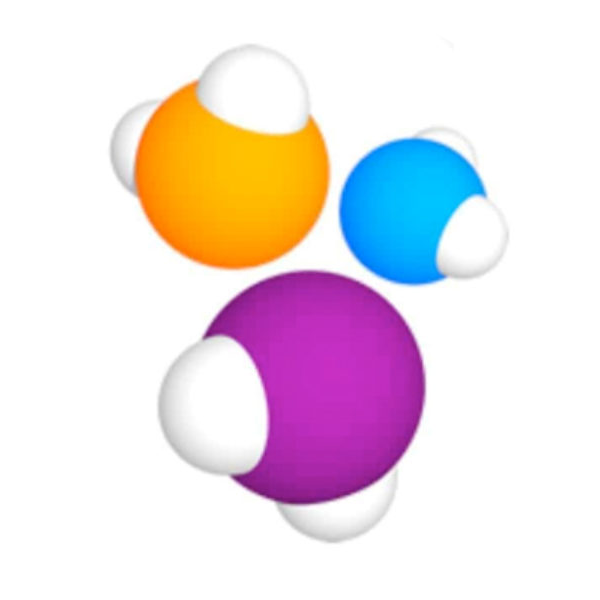
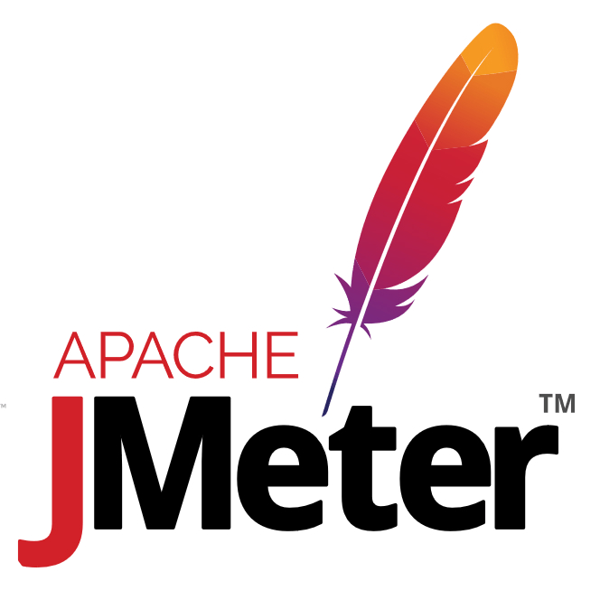

### Привет, меня зовут Константин 👋

 

### 🧐 Обо мне
В тестировании ПО около 4 лет. За это время мне удалось поработать с очень интересными
проектами - в букмекерской компании, в крупнейшем частном банке России и в
омниканальной коммуникационной онлайн - платформе. Легко нахожу общий язык с
людьми, с легкостью вливаясь в новый коллектив. Активно развиваюсь в сторону
автоматизации тестирования на Java. Я нашел себя в улучшении качества продукта и
искренне люблю это дело.

Мне нравится исследовать новый стек технологий 💻 и использовать их для создания крутых вещей 🛠️.

📝 Вы можете ознакомиться с моим [резюме](https://drive.google.com/file/d/1rGpKPm1M5Nqd6KdtE3jqHSaBCJbnFxMA/view?usp=drive_link) .

### 🔨 Навыки и инструменты:

<code></code>
<code></code>
<code></code>
<code></code>
<code></code>
<code></code>
<code></code>
<code></code>
<code></code>

### 📈 моя статистика на гитхабе

 

<!--
**Kostoson/kostoson** is a ✨ _special_ ✨ repository because its `README.md` (this file) appears on your GitHub profile.

Here are some ideas to get you started:

- 🔭 I’m currently working on ...
- 🌱 I’m currently learning ...
- 👯 I’m looking to collaborate on ...
- 🤔 I’m looking for help with ...
- 💬 Ask me about ...
- 📫 How to reach me: ...
- 😄 Pronouns: ...
- ⚡ Fun fact: ...
-->
